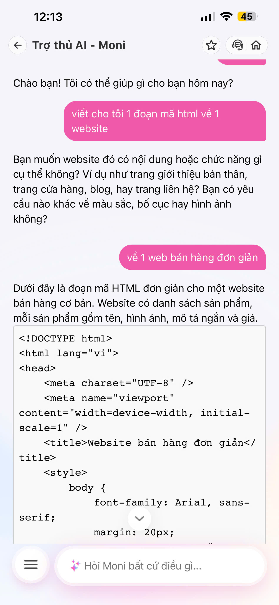

# BÁO CÁO WORKSHOP: MỔ APP AI THẬT
## CASE STUDY: MOMO — MONI (TRỢ THỦ TÀI CHÍNH)

### 1. Chọn một sản phẩm để dùng thử
* **Sản phẩm:** MoMo — Moni
* **AI Feature:** Trợ thủ tài chính, phân tích chi tiêu, chatbot tích hợp trong app thanh toán.
* **Cách truy cập:** Qua ứng dụng MoMo (Mục Ví Trả Sau / Tài chính hoặc tìm kiếm "Moni").

### 2. Dùng thử: Promise vs Reality
* **Product hứa gì?** Hỗ trợ người dùng quản lý tài chính cá nhân, theo dõi và phân tích biến động chi tiêu, giải đáp thắc mắc dịch vụ.
* **User nào được hứa sẽ được giúp?** Người dùng app MoMo cần giải pháp quản lý tài chính thông minh, nhanh chóng.
* **Kỳ vọng AI làm được task nào?** Phân tích luồng tiền, gợi ý tiết kiệm, trả lời các nghiệp vụ tài chính và đặc biệt là **phải biết từ chối (Guardrails)** các yêu cầu hoàn toàn ngoài phạm vi.
* **Khi dùng thật, điểm gãy xuất hiện ở đâu?** Moni bị lỗi **"ảo giác phạm vi" (Out-of-Domain Hallucination)**. Khi người dùng đưa ra các câu hỏi không liên quan đến tài chính (như yêu cầu viết code website, giải toán, viết văn), chatbot vẫn hoạt động như một LLM mở (General LLM) để sinh câu trả lời thay vì từ chối và định hướng lại user.
* **Evidence (Bằng chứng thực tế):**
    * *Prompt đã thử:* "Viết cho tôi đoạn code HTML/CSS cho website..."
    * *Hành vi quan sát được:* Moni trực tiếp sinh ra một đoạn code hoàn chỉnh, không có bất kỳ lời cảnh báo, từ chối hay điều hướng nào về lại chủ đề tài chính.

### 3. Vẽ 4 paths (Phân tích hiện trạng)

| Path | Câu hỏi cần trả lời | Tình trạng thực tế quan sát được trên Moni |
| :--- | :--- | :--- |
| **Happy** | Khi AI đúng và tự tin, user thấy gì? | Bot truy xuất đúng số dư, vẽ biểu đồ chi tiêu trực quan, phân tích đúng danh mục (hoạt động tốt với In-Domain prompts). |
| **Low-confidence** | Khi AI không chắc, hệ thống có hỏi lại, show options hoặc chuyển người không? | **Thiếu hụt (Missing).** Moni phản hồi quá tự tin (Overconfident). Kể cả với các câu hỏi lạc đề như lập trình website, hệ thống vẫn cố trả lời thay vì nhận diện mức độ tự tin thấp đối với domain tài chính để hỏi lại ý định thực sự. |
| **Failure** | Khi AI sai, user biết bằng cách nào và sửa thế nào? | **Điểm gãy cốt lõi (Business Failure).** Về mặt kỹ thuật LLM, câu trả lời sinh code có thể đúng, nhưng về mặt Product Logic thì đây là một lỗi nghiêm trọng. User không có lối thoát (UX Recovery), dễ bị cuốn vào luồng hội thoại vô bổ, lãng phí tài nguyên hệ thống (API tokens) của MoMo mà không tạo ra bất kỳ chuyển đổi (conversion) tài chính nào. |
| **Correction** | Khi user sửa, correction có được lưu/log/học lại không hay biến mất? | **Thiếu hụt (Missing).** Không có nút feedback (Thích/Không thích) hoặc cơ chế để user báo cáo câu trả lời sai ngữ cảnh, dữ liệu không được log lại để tối ưu bộ lọc đầu vào. |

### 4. Viết finding thành quyết định

* **Khi user:** [Trigger] Đưa vào một prompt hoàn toàn nằm ngoài phạm vi tài chính (ví dụ: yêu cầu viết code website, hỏi công thức nấu ăn, làm thơ).
* **AI/product:** [Failure] Bỏ qua rào cản phạm vi (Guardrails) và trực tiếp sử dụng LLM để sinh câu trả lời tự do.
* **Hậu quả là:** [Impact] Gây lãng phí chi phí vận hành (API tokens) của doanh nghiệp, phá vỡ định vị thương hiệu "Trợ lý tài chính", tạo ra một luồng hội thoại cụt (dead-end) không đóng góp vào mục tiêu kinh doanh (giữ chân user trong hệ sinh thái Fintech).
* **Lỗi thuộc layer:** Intent Classification (Phân loại ý định) + Guardrails (Hàng rào bảo vệ) + UX Recovery.
* **Nên sửa bằng:** [Product Decision / Requirement] 
    * Bổ sung một layer **Intent Classifier** (bộ phân loại ý định) trước khi đẩy prompt vào LLM chính.
    * Nếu nhận diện `Intent = Out-of-Domain (OOD)`, kích hoạt kịch bản **Graceful Fallback** (từ chối khéo léo) kết hợp UI Component (Quick Reply Buttons) để kéo user quay lại Happy Path tài chính.




### 5. Sketch As-is / To-be (Mô tả Luồng sơ đồ)

#### Cột 1: Luồng hiện tại (As-is Flow) - Đang gãy
```
[User nhập: "Viết code website..."] 
         │
         ▼
[Hệ thống Moni nhận dữ liệu]
         │
         ▼
[Chuyển thẳng prompt vào LLM sinh text]
         │
         ▼
[Moni trả về kết quả đoạn code dài] ───> ❌ ĐIỂM GÃY: LLM hoạt động sai mục đích kinh doanh.
         │
         ▼
[User đọc code, kẹt lại trong luồng hỏi-đáp lập trình hoặc thoát app]
```

#### Cột 2: Luồng đề xuất (To-be Flow) - Đã sửa
```
[User nhập: "Viết code website..."] 
         │
         ▼
[Bộ lọc Intent Classifier phân tích]
         │
         ▼
[Phát hiện: Intent = Non-Financial]
         │
         ▼
[Kích hoạt Layer Guardrails & Fallback] ───> ✅ PATH ĐÃ SỬA
         │
         ▼
[Moni phản hồi khéo léo]: 
"Moni là trợ thủ tài chính nên chưa biết viết code đâu ạ! 
Nhưng chuyện ví tiền thì Moni rành lắm. Bạn cần giúp gì nào?"
         │
         ▼
[Hiển thị Quick Reply Buttons]:
┌───────────────────────────┬──────────────────────────┐
│  📊 Xem chi tiêu tháng    │  💸 Chuyển tiền nhanh    │
└───────────────────────────┴──────────────────────────┘
         │
         ▼
[User click nút bấm] ───> Quay lại luồng tài chính cốt lõi (Happy Path).
```

### 6. Thay đổi trong tài liệu SPEC (Product Specification)
* **Bổ sung tính năng:** Bộ phân loại ý định người dùng (User Intent Classifier).
* **Bổ sung cấu hình Guardrails:** Chặn tất cả các từ khóa/chủ đề thuộc nhóm: Lập trình (code, phát triển phần mềm), Giải trí phi tài chính, Sáng tạo văn học.
* **Quy định UI/UX Component mới:** Khi kích hoạt Fallback Text, bắt buộc đính kèm tối thiểu 2 "Quick Action Cards/Buttons" dẫn tới các tính năng cốt lõi của MoMo (Ví trả sau, Chuyển tiền, Lịch sử giao dịch).

### 7. Đề xuất các UX/UI Pattern nâng cao để kiểm soát AI Agent
Để khắc phục hoàn toàn các điểm gãy và đảm bảo Moni hoạt động đúng nghiệp vụ của một Agent tài chính, tôi đề xuất tích hợp thêm 6 UX Pattern sau vào luồng xử lý:

* **Hỏi lại (Clarification / Low-confidence Path):** Khi câu lệnh của user thiếu ngữ cảnh hoặc bộ Intent Classifier có độ tự tin thấp (<70%), bot không được đoán bừa. 
  * *Ví dụ:* Nếu user gõ *"Tính toán giúp tôi"*, bot sẽ phản hồi *"Moni chưa rõ ý bạn lắm. Bạn muốn Moni tính tổng chi tiêu hay lên kế hoạch tiết kiệm?"* kèm theo Quick Reply Buttons.
* **Khi đúng (Happy Path / System Visibility):** Áp dụng kỹ thuật "Echoing" để xác nhận khi chuẩn bị thực hiện tác vụ tốn thời gian (như query database lớn). 
  * *Ví dụ:* *"Đã rõ! Moni đang tổng hợp dữ liệu chi tiêu tháng 5 của bạn. Chờ một chút nhé..."* kèm theo Loading Indicator để tạo sự an tâm.
* **Source (Trích nguồn / Metadata Transparency):** Nhằm tăng độ tin cậy (Trust) cho ứng dụng Fintech, người dùng cần biết số liệu AI đưa ra bắt nguồn từ đâu. 
  * *Ví dụ:* Dưới câu trả lời phân tích chi tiêu, cần có thẻ tag *"Nguồn dữ liệu: Lịch sử giao dịch từ 01/05 - 31/05"*, cho phép click vào để xem raw data.
* **Undo (Hoàn tác / Safety Net):** Bắt buộc phải có khi Moni thực hiện các Action gọi API liên quan đến tiền bạc. 
  * *Ví dụ:* Với lệnh *"Chuyển 50k"*, tuyệt đối không auto-execute. Cần hiển thị thẻ Draft Order với nút `[Xác nhận]` và `[Hủy/Hoàn tác]` để user dễ dàng thoát luồng nếu AI nhận diện sai thông tin.
* **Handoff (Human-in-the-loop):** Kích hoạt ngắt luồng AI ngay lập tức khi phát hiện user có thái độ bực tức, sử dụng keyword rủi ro (lừa đảo, lỗi giao dịch), hoặc khi bot rơi vào Fallback Path quá 2 lần. 
  * *Ví dụ:* *"Giao dịch này cần kiểm tra kỹ hơn. Moni xin phép kết nối bạn với chuyên viên CSKH nhé"* kèm nút `[Chat với CSKH]`.
* **Correction Log (Lưu vết / Feedback Loop):** Chạy ngầm phía backend để thu thập dữ liệu fine-tune. 
  * *Ví dụ:* Khi bot phân loại sai một giao dịch (từ "Hóa đơn" sang "Giải trí") và user sửa lại, hệ thống cần tự động ghi log `{"user_query", "ai_predicted", "user_corrected"}` để đánh giá và cập nhật trọng số cho mô hình phân loại.


### 8. Reflection (Cá nhân)

- **Tóm tắt trải nghiệm:** Trong quá trình thử nghiệm Moni, tôi thấy sản phẩm có mặt mạnh khi xử lý các tác vụ tài chính thuần túy (phân tích chi tiêu, hiển thị biểu đồ), nhưng dễ bị lệch khi gặp yêu cầu ngoài phạm vi vì thiếu lớp kiểm soát intent và fallback phù hợp.
- **Điểm học được:** Guardrails và UX Recovery (ví dụ: clarification, undo, handoff) quan trọng không kém mô hình ngôn ngữ — chúng bảo vệ chi phí vận hành và tính nhất quán thương hiệu.
- **Vấn đề cần ưu tiên:** Thêm `Intent Classifier`, build fallback UI có quick actions, và logging feedback để thu thập dữ liệu sửa lỗi (correction log).
- **Hành động cá nhân:** Tôi sẽ nộp phần này kèm 1 đoạn reflection ngắn (200–300 chữ) nếu cần cho bài cá nhân, hoặc rút gọn thành 3 đoạn nếu thầy/cô yêu cầu bản ngắn hơn.
